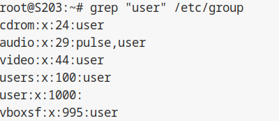
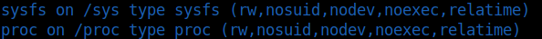
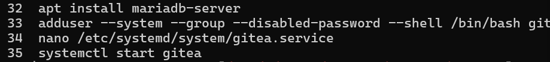

# Configuration matérielle dans VirtualBox

>  1. Que signifie "64-bit" dans "Debian 64-bit" ?

64-bit signifie l'achitecture du processeur, et Debian est un sytème d'exploitation linux. Donc notre cas (Debian 64-bit) signifie que l'architecture du processeur est 64-bit sur un système d'exploitation Debian.


> 2. Quelle est la configuration réseau utilisée par défaut ?

La configuration réseau utilisée par défaut est Network
Address Translation (c'est-à-dire NAT). Le NAT permet à plusieurs appareils de partager un nombre limité d'adresses IP publiques il améliore donc améliore la sécurité et optimise la gestion des adresses IP.

> 3. Quel est le nom du fichier XML contenant la configuration de votre machine ?

Le fichier XML qui contient la configuration la VM est dans le chemin :

```
~/.VirtualBox/Machines/sae203/sae203.xml
```

> 4. Sauriez-vous le modifier directement ce fichier de configuration pour mettre 2 processeurs à votre machine ?

On peut en effet ajouter 1 autre processeur à notre machine en modifiant la valeur count dans le fichier XML

```XML
<CPU count="1"/>
```


    On remplace le 1 par 2


```XML
<CPU count="2"/>
```

(N'oublions pas d'enregistrer)

## Installation OS de base

> 1. Qu'est-ce qu'un fichier ISO bootable ?

Un fichier ISO bootable est un fichier conçu pour s'éxecuter au démarrage de
l'ordinateur et installer des systèmes d'exploitations par exemple.


> 2. Qu'est-ce que MATE ? GNOME ?

MATE est un environnement de bureau libre et open source pour les systèmes d'exploitation de type Unix, dérivé de GNOME 2, il permet de fournir un environnement de bureau stable et traditionnel avec une interface utilisateur intuitive et des applications configurables.

Gnome (acronyme de GNU Network Object Model Environment) est lui aussi un environnement de bureau libre et open source pour les systèmes d'exploitation de type Unix.
Il vise à fournir une interface utilisateur intuitive et accessible à tous ainsi qu'un large éventail d'applications.


> 3. Qu'est-ce qu'un serveur web ?

Un serveur web est un ordinateur qui stocke, traite et envoie de sites web aux navigateurs web des utilisateurs. Il est essentiel au fonctionnement du W3C (ou World Wide Web Consortium, est un organisme international qui développe des standards pour le Web afin que les gens puissent communiquer efficacement à travers Internet) car il permet aux internautes d'accéder aux pages web, aux images, aux vidéos et aux autres contenus hébergés sur des serveurs distants.

> 4. Qu'est-ce qu'un serveur ssh ?

Un serveur SSH, ou Secure Shell Server, est un logiciel qui s'exécute sur un ordinateur et qui permet aux utilisateurs de se connecter à cet ordinateur à distance de manière sécurisée.


> 5. Qu'est-ce qu'un serveur mandataire ?

Un serveur mandataire, aussi appelé proxy, est un intermédiaire entre un serveur et un client sur un réseau. Il agit comme un "relais" pour les requêtes et les réponses.

## Sudo

> 1. Comment peux-ton savoir à quels groupes appartient l’utilisateur user ?

Pour  voir à quels groupes appaartient l'utilsateur user on utilise la commande suivante:

```
grep "user" /etc/group
```

Ce qui donne:



grep qui permet d'afficher les lignes avec un motif (en l'occurence user)

## Suppléments invités

> 1. Quel est la version du noyau Linux utilisé par votre VM ?

Par défaut le Noyau Linux 5.4 est utilisé

> 2. À quoi servent les suppléments invités ?

Les suppléments invités permettent d'améliorer les performances de notre VM

> 3. À quoi sert la commande mount ?

Il permet de monter un système de fichier ou lister comme un disque dur par exemple



## Quelques Questions


> 1. Qu'est-ce que le Projet Debian ? D'où vient le nom Debian ?

      Combinaison des noms de Ian Murdock et de sa petite amie de l'époque, [Debra Lynn.](https://www.debian.org/doc/manuals/project-history/project-history.fr.pdf)

> 2. Il existe 3 durées de prise en charge (support) de ces versions : la durée minimale, la durée en support long terme (LTS) et la durée en support long terme étendue (ELTS). Quelle sont les durées de ces prises en charge ?

- La durée de prise en charge minimale (version stable) est de [3 ans](https://www.debian.org/releases/index.fr.html)
- La durée de prise en charge à long terme de Debian (Debian Long Term Support – LTS), est un projet pour étendre la durée de vie de toutes les versions stables de Debian à (au moins) [5 ans](https://www.debian.org/lts/index.fr.html)
- La durée de support long terme étendue quant à elle permet d'ajouter une durée de 1 an (en plus des 5 ans de LTS)

> 3. Pendant combien de temps les mises à jour de sécurité seront-elles fournies ?

- 3 ans pour la version stable
- 5 ans pour la version support long terme (LTS)
- 1 an de mises à jour de sécurité uniquement (en plus des 5 ans de LTS) - pour la version ELTS (support long terme étendue)


> 4. Combien de version au minimum sont activement maintenues par Debian ? Donnez leur nom
générique (= les types de distribution).

[3 versions](https://www.debian.org/releases/index.fr.html) sont activement maintenues par Debian : "stable", "testing", "unstable"

> 5. Chaque distribution majeur possède un nom de code différent. Par exemple, la version majeur
actuelle (Debian 12) se nomme bookworm. D’où viennent les noms de code données aux
distributions ?

Les noms de code données aux distributions proviennent du nom des personnages du film d'animation Pixar Toy Story.

> 6. L’un des atouts de Debian fut le nombre d’architecture ( = processeurs) officiellement prises en
charge. Combien et lesquelles sont prises en charge par la version Bullseye ?

 Il y'a officiellement [8 architectures](https://www.debian.org/ports/) prises en charge (amd64, arm64, armel, armhf, i386, mips64el, ppc54el, powerpc64, s390x) dont riscv64 "en test"

> 7. Première version avec un nom de code

    Le premier nom de code attribué est Buzz annoncé en 1996, c'est la version 0.93

> 8. Dernière nom de code attribué

Le dernier nom de code attribué est "Bookworm" annoncé en 2022, c'est Debian 12

# Configuration de Git


```sh
git config --global user.name "Prénom Nom"
```

Cette ligne de commande permet d'associer votre nom d'utilisateur à Git.

```sh
git config --global user.email "votre@email"
```

Cette ligne de commande permet d'associer votre adresse e-mail à Git.

```sh
git config --global init.defaultBranch "main"
```
Cette ligne de commande permet d'associer le nom de la branche avec Git (par défaut main)

Voici les commandes utilisées:


##  Préliminaire

> 1. Qu’est-ce que le logiciel gitk ? Comment se lance-t-il ?

Gitk est une interface graphique qui permet de naviguer dans des dépots git plus simplement qu'avec l'affichage terminal\
Linux: Tapez gitk dans votre terminal.\
MacOS: Utilisez Spotlight pour rechercher "Gitk" et lancez l'application.\
Windows: Recherchez "Gitk" dans le menu Démarrer et lancez l'application.

>1.2 Qu’est-ce que le logiciel git-gui ? Comment se lance-t-il ?

Git-gui est un logiciel d'interface graphique (GUI) pour le système de contrôle de version Git. Il permet d'effectuer des opérations comme créer et cloner des dépôts et
afficher l'historique des commits

## Comparons

> 1. Pourquoi avez-vous choisi ce logiciel ?

Il y'a une interface intuitive pour une utilisation facile. et des Outils optimisés pour accélérer le développement (en général).

> 2. Comment l’avez vous installé ?

GitKraken est assez simple à installer il y'a juste un fichier en .deb qu'il faut utiliser en mettant cette commande:

```sh
sudo dpkg -i "fichier".deb
```

> 3. Comparer-le aux outils inclus avec git (et installé précédemment) ainsi qu’avec ce qui serait fait en ligne de commande pure : fonctionnalités avantages, inconvénients…


|                        | Avantages                                                               | Inconvénients                                                      |
|------------------------|-------------------------------------------------------------------------|--------------------------------------------------------------------|
| Git                    | Puissants, flexibles, légers,  intégrés.                                | Courbe d'apprentissage, manque de visuel,  CLI complexe.           |
| GitKraken              | Interface intuitive, collaboration,  visualisation, facile à apprendre. | Moins flexible, installation nécessaire,  version gratuite limitéé |
| Ligne de Commande Pure | Puissants, flexibles, légers, intégrés.                                 | Syntaxe complexe, erreurs possibles,  pas de visuel.               |

Conclusion:

Débutants: GitKraken\
Expérimentés: Outils Git Natifs\
Avancés: Ligne de Commande

#  Installation Gitea

## Listes de commandes à utiliser pour réussir à installer Gitea



```sh
sudo su #Se connecter en super-utilisateur (root)
apt install mariadb-server #Installer Maria-DB
adduser --system --group --disabled-password --shell /bin/bash git  #Crée un utilisateur "git" sans mot de passe.
mysql -u root -p #Se connecte à MySQL en tant que "root"
nano /etc/systemd/system/gitea.service #Ouvre le fichier de configuration systemd
systemctl start gitea #Démarre le service Gitea manuellement
nano /etc/nginx/sites-available/gitea #Ouvre le fichier de configuration Nginx
```

## Commande permettant de modifier le fichier Gitea

```sh
sudo ln -s /etc/nginx/sites-available/gitea /etc/nginx/sites-enabled/ #Crée un lien symbolique pour activer la configuration Nginx 
sudo apt install ufw #Installe le pare-feu UFW (si pas déjà installé)
sudo ufw enable #Installe le pare-feu UFW (si pas déjà installé)
sudo ufw allow 80/tcp #Autorise le trafic HTTP (port 80) via UFW
sudo ufw allow 443/tcp #Idem mais pour HTTPS (port 443)
```


## Interface graphique de Gitea


## Création avec le GUI de Gitea


<style>

/* Style général */
body {
  font-family: Arial, sans-serif;
  line-height: 1.6;
  margin: 0;
  padding: 0;
  background-color: #f8f8f8;
}

.container {
  max-width: 800px;
  margin: 20px auto;
  padding: 20px;
  background-color: #fff;
  border-radius: 8px;
  box-shadow: 0 0 10px rgba(0, 0, 0, 0.1);
}

/* Styles pour les titres */
h1, h2, h3 {
  color: #333;
  margin-bottom: 15px;
}

h1 {
  font-size: 24px;
  text-decoration: underline;
}

h2 {
  font-size: 20px;
}

h3 {
  font-size: 18px;
}

/* Style pour les paragraphes */
p {
  color: #666;
}

/* Style pour les liens */
a {
  color: #007bff;
  text-decoration: none;
}

a:hover {
  text-decoration: underline;
}

/* Style pour les listes */
ul, ol {
  margin-bottom: 15px;
}

/* Style pour les listes imbriquées */
ul ul, ol ol, ul ol, ol ul {
  margin-top: 0;
  margin-bottom: 0;
}

/* Style pour les blocs de citation */
blockquote {
  background-color: #f9f9f9;
  border-left: 4px solid #007bff;
  margin: 0;
  padding: 10px 20px;
}

/* Style pour les images */
img {
  max-width: 100%;
  height: auto;
  margin-bottom: 15px;
}

/* Style pour les tableaux */
table {
  width: 100%;
  border-collapse: collapse;
  margin-bottom: 15px;
}

table, th, td {
  border: 1px solid #ddd;
}

th, td {
  padding: 8px;
  text-align: left;
}

/* Style pour les légendes de figure */
figcaption {
  margin-top: 5px;
  font-size: 14px;
  color: #888;
}

/* Style pour le pied de page */
footer {
  text-align: center;
  margin-top: 20px;
  color: #888;
}

</style>